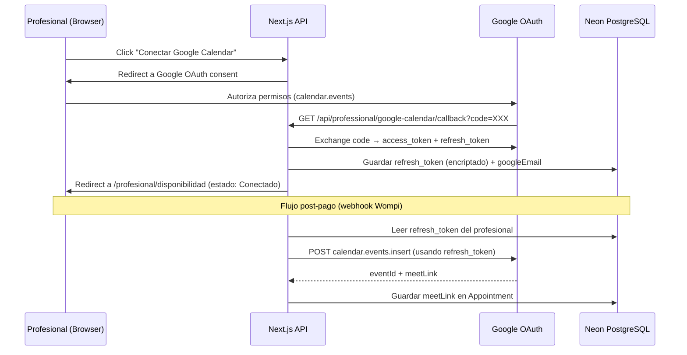
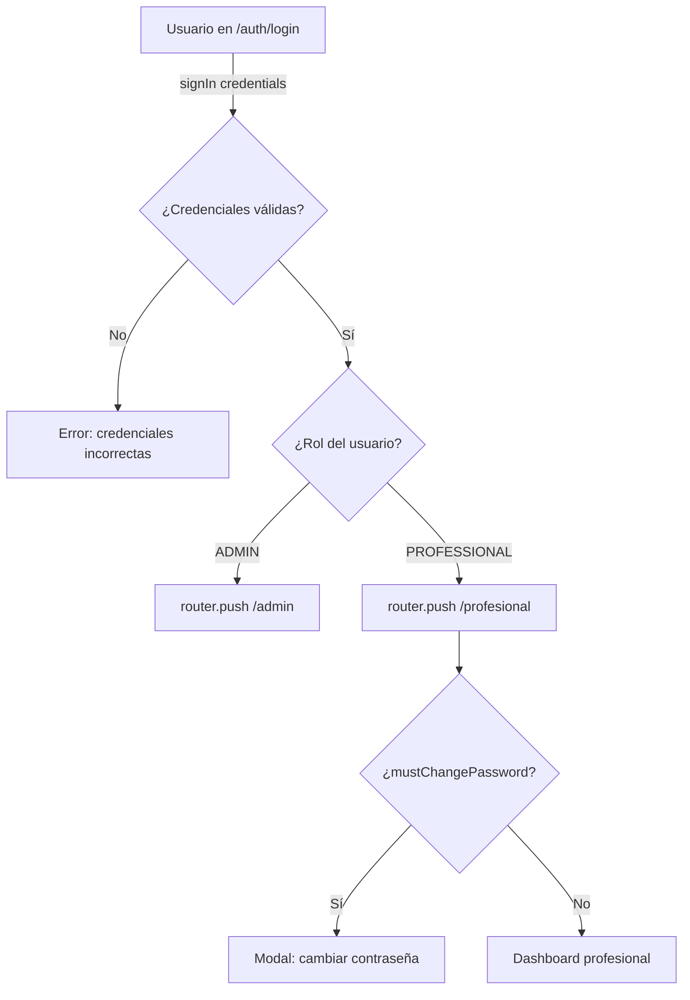
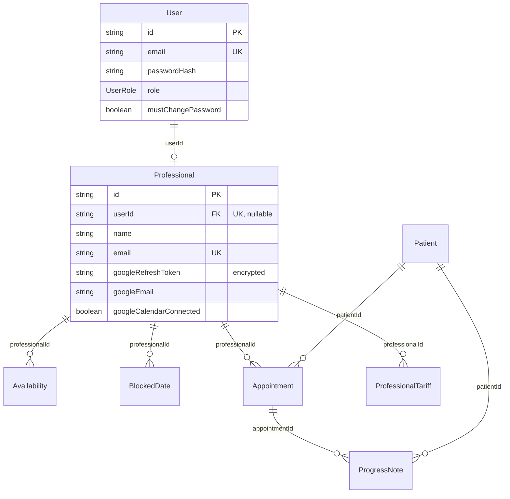

# Documento de Diseño — Portal del Profesional + OAuth Google Calendar

## Overview

El Portal del Profesional es un módulo independiente dentro de la aplicación conAlma que permite a cada psicóloga gestionar su práctica profesional de forma autónoma. Se implementa como un route group `(professional)` en Next.js App Router, con layout, sidebar y middleware propios, reutilizando la misma infraestructura de autenticación (NextAuth v5 JWT).

### Objetivos principales

- Dar autonomía a cada profesional para gestionar su disponibilidad, perfil y pacientes
- Implementar OAuth 2.0 con Google Calendar para generar eventos con Meet automáticamente
- Garantizar aislamiento total de datos entre profesionales (multi-tenancy por fila)
- Mantener el panel admin intacto, removiendo solo la edición de disponibilidad

### Alcance

- Login compartido con redirección por rol
- 6 módulos: Dashboard, Perfil, Disponibilidad + OAuth, Calendario, Pacientes, Ingresos
- Modificaciones al schema de Prisma (campos OAuth en Professional, relación User ↔ Professional)
- Nuevas API routes protegidas por rol PROFESSIONAL
- Ajustes al middleware para proteger `/profesional/*`

## Architecture

### Diagrama de módulos del Portal Profesional

```mermaid
graph TB
    subgraph "Route Group: (professional)"
        LP[Layout Profesional<br/>ProfessionalSidebar + Main]
        D[/profesional<br/>Dashboard]
        P[/profesional/perfil<br/>Perfil]
        DI[/profesional/disponibilidad<br/>Disponibilidad + OAuth]
        C[/profesional/calendario<br/>Calendario]
        PA[/profesional/pacientes<br/>Pacientes]
        I[/profesional/ingresos<br/>Ingresos]
    end

    subgraph "API Routes"
        API_PROF[/api/professional/profile]
        API_AVAIL[/api/professional/availability]
        API_OAUTH[/api/professional/google-calendar]
        API_CAL[/api/professional/appointments]
        API_PAT[/api/professional/patients]
        API_INC[/api/professional/income]
    end

    subgraph "Servicios Externos"
        GOOGLE[Google OAuth 2.0<br/>+ Calendar API v3]
        NEON[(Neon PostgreSQL)]
    end

    LP --> D & P & DI & C & PA & I
    D --> API_CAL & API_INC
    P --> API_PROF
    DI --> API_AVAIL & API_OAUTH
    C --> API_CAL
    PA --> API_PAT
    I --> API_INC
    API_OAUTH --> GOOGLE
    API_PROF & API_AVAIL & API_CAL & API_PAT & API_INC --> NEON
```

### Flujo de datos OAuth 2.0 con Google Calendar



### Flujo de autenticación y redirección por rol



### Decisiones arquitectónicas

| Decisión                       | Elección                                                             | Justificación                                                                                              |
| ------------------------------ | -------------------------------------------------------------------- | ---------------------------------------------------------------------------------------------------------- |
| Almacenamiento OAuth token     | Campo encriptado en tabla Professional                               | Evita tabla separada; un profesional = un token. Se encripta con AES-256-GCM usando `OAUTH_ENCRYPTION_KEY` |
| Relación User ↔ Professional   | Campo `userId` en Professional (1:1)                                 | Reutiliza la autenticación existente sin duplicar lógica de login                                          |
| Protección de rutas            | Middleware + verificación de rol en API                              | Middleware verifica cookie; API routes verifican rol del JWT                                               |
| Multi-tenancy                  | Filtro `WHERE professionalId = session.professionalId` en cada query | Aislamiento por fila, sin schemas separados                                                                |
| Sidebar profesional            | Componente nuevo `ProfessionalSidebar`                               | Misma estructura que `AdminSidebar` pero con navegación propia                                             |
| Google Calendar event creation | Fire-and-forget con try/catch                                        | Si falla, la cita se confirma igual (Req 6.6)                                                              |
| Generación contraseña temporal | `crypto.randomBytes(12).toString('base64url')`                       | 16 chars alfanuméricos, suficiente entropía                                                                |

## Components and Interfaces

### Estructura de carpetas (nuevos archivos)

```
src/
├── app/
│   ├── (professional)/
│   │   ├── layout.tsx                          # Root layout del route group
│   │   └── profesional/
│   │       ├── layout.tsx                      # Layout con ProfessionalSidebar
│   │       ├── page.tsx                        # Dashboard
│   │       ├── perfil/page.tsx                 # Perfil editable
│   │       ├── disponibilidad/page.tsx         # Disponibilidad + OAuth
│   │       ├── calendario/page.tsx             # Calendario de citas
│   │       ├── pacientes/
│   │       │   ├── page.tsx                    # Lista pacientes
│   │       │   └── [id]/page.tsx               # Ficha paciente + notas
│   │       └── ingresos/page.tsx               # Vista de ingresos
│   └── api/
│       └── professional/
│           ├── profile/route.ts                # GET, PUT
│           ├── availability/route.ts           # GET, POST, DELETE
│           ├── blocked-dates/route.ts          # GET, POST, DELETE
│           ├── appointments/route.ts           # GET, PATCH (completar)
│           ├── patients/route.ts               # GET
│           ├── patients/[id]/route.ts          # GET
│           ├── patients/[id]/notes/route.ts    # GET, POST
│           ├── income/route.ts                 # GET
│           ├── google-calendar/
│           │   ├── connect/route.ts            # GET (inicia OAuth)
│           │   ├── callback/route.ts           # GET (recibe code)
│           │   ├── disconnect/route.ts         # POST (revoca)
│           │   └── status/route.ts             # GET (estado conexión)
│           ├── change-password/route.ts        # POST
│           └── dashboard/route.ts              # GET (stats)
├── components/
│   ├── layouts/
│   │   └── professional-sidebar.tsx
│   └── professional/
│       ├── dashboard-stats.tsx
│       ├── profile-form.tsx
│       ├── profile-preview.tsx
│       ├── availability-manager.tsx
│       ├── google-calendar-connect.tsx
│       ├── calendar-view.tsx
│       ├── appointment-detail-modal.tsx
│       ├── patient-list.tsx
│       ├── patient-detail.tsx
│       ├── progress-note-form.tsx
│       ├── income-summary.tsx
│       ├── income-filters.tsx
│       ├── income-table.tsx
│       └── change-password-modal.tsx
├── lib/
│   ├── google-oauth.ts                         # OAuth helpers (construct URL, exchange code, refresh)
│   ├── encryption.ts                           # AES-256-GCM para tokens
│   ├── password-generator.ts                   # Genera contraseña temporal
│   └── validations/
│       ├── professional-profile.ts             # Zod schema perfil
│       ├── availability.ts                     # Zod schema disponibilidad
│       └── progress-note.ts                    # Zod schema notas
└── stores/
    └── professional-store.ts                   # Zustand (UI state del portal)
```

### API Routes — Interfaces detalladas

#### `GET /api/professional/dashboard`

Retorna estadísticas del profesional logueado para el dashboard.

```typescript
// Response 200
interface DashboardResponse {
  todayAppointments: AppointmentSummary[];
  upcomingAppointments: AppointmentSummary[]; // max 5
  monthlyIncome: {
    totalBilled: number; // suma de montos cobrados
    commission: number; // comisión descontada
    netIncome: number; // neto a recibir
  };
}

interface AppointmentSummary {
  id: string;
  patientName: string;
  serviceName: string;
  date: string; // ISO date
  startTime: string; // HH:mm
  endTime: string;
  status: AppointmentStatus;
  meetLink: string | null;
}
```

#### `GET /api/professional/profile` | `PUT /api/professional/profile`

```typescript
// GET Response 200
interface ProfessionalProfile {
  id: string;
  name: string; // readonly
  email: string; // readonly
  specialty: string; // editable
  description: string | null; // editable
  traits: string[]; // editable
  photoUrl: string | null; // editable
  tariff: {
    // readonly
    price: number;
    commission: number;
  };
  googleCalendarConnected: boolean;
  googleCalendarEmail: string | null;
}

// PUT Body (Zod validated)
interface UpdateProfileBody {
  specialty?: string;
  description?: string | null;
  traits?: string[];
  photoUrl?: string | null;
}
```

#### `GET /api/professional/availability` | `POST` | `DELETE`

```typescript
// GET Response 200
interface AvailabilityResponse {
  blocks: AvailabilityBlock[];
  blockedDates: BlockedDateEntry[];
}

interface AvailabilityBlock {
  id: string;
  dayOfWeek: number; // 0=domingo, 6=sábado
  startTime: string; // HH:mm
  endTime: string;
  isActive: boolean;
}

// POST Body
interface CreateAvailabilityBody {
  dayOfWeek: number; // 0-6
  startTime: string; // HH:mm format
  endTime: string; // HH:mm format, must be > startTime
}

// DELETE /api/professional/availability?id=xxx
```

#### `GET /api/professional/google-calendar/connect`

Construye la URL de OAuth y redirige al profesional a Google consent screen.

```typescript
// Redirect 302 → https://accounts.google.com/o/oauth2/v2/auth?
//   client_id=GOOGLE_OAUTH_CLIENT_ID
//   redirect_uri=APP_URL/api/professional/google-calendar/callback
//   scope=https://www.googleapis.com/auth/calendar.events
//   access_type=offline
//   prompt=consent
//   state=professionalId (signed)
```

#### `GET /api/professional/google-calendar/callback`

Recibe el authorization code de Google, lo intercambia por tokens.

```typescript
// Query params: code, state
// Actions:
// 1. Verify state (contains professionalId, signed)
// 2. Exchange code for access_token + refresh_token
// 3. Fetch Google userinfo to get email
// 4. Encrypt refresh_token with AES-256-GCM
// 5. Store encrypted token + googleEmail in Professional
// 6. Redirect to /profesional/disponibilidad?connected=true
```

#### `POST /api/professional/google-calendar/disconnect`

```typescript
// Actions:
// 1. Read refresh_token from DB
// 2. Call Google revoke endpoint
// 3. Clear googleRefreshToken + googleEmail from Professional
// Response 200: { success: true }
```

#### `GET /api/professional/appointments` | `PATCH`

```typescript
// GET Response 200
interface AppointmentsResponse {
  appointments: AppointmentDetail[];
}

interface AppointmentDetail {
  id: string;
  patient: { id: string; fullName: string; email: string };
  service: { name: string; durationMin: number };
  date: string;
  startTime: string;
  endTime: string;
  status: AppointmentStatus;
  meetLink: string | null;
  googleEventId: string | null;
  createdAt: string;
}

// PATCH /api/professional/appointments (mark as completed)
interface CompleteAppointmentBody {
  appointmentId: string;
}
// Only allows CONFIRMED → COMPLETED transition
```

#### `GET /api/professional/patients` | `GET /api/professional/patients/[id]`

```typescript
// GET /patients Response 200
interface PatientsListResponse {
  patients: PatientSummary[];
}

interface PatientSummary {
  id: string;
  fullName: string;
  preferredName: string | null;
  email: string;
  lastAppointmentDate: string | null;
  totalAppointments: number;
}

// GET /patients/[id] Response 200
interface PatientDetailResponse {
  patient: Patient; // full patient record (readonly)
  appointments: AppointmentSummary[]; // history with this professional
  progressNotes: ProgressNoteEntry[];
}
```

#### `POST /api/professional/patients/[id]/notes`

```typescript
// Body (Zod validated)
interface CreateNoteBody {
  content: string; // min 1 char, max 5000
  appointmentId?: string; // optional: link to specific appointment
}

// Response 201
interface ProgressNoteEntry {
  id: string;
  content: string;
  appointmentId: string | null;
  createdAt: string;
}
```

#### `GET /api/professional/income`

```typescript
// Query params: startDate, endDate (ISO strings, optional)
// Defaults to current month if not provided

// Response 200
interface IncomeResponse {
  summary: {
    totalBilled: number;
    totalCommission: number;
    netIncome: number;
    period: { start: string; end: string };
  };
  sessions: IncomeSessionDetail[];
}

interface IncomeSessionDetail {
  appointmentId: string;
  date: string;
  patientName: string;
  serviceName: string;
  amount: number; // monto cobrado
  commissionRate: number; // % (ej: 40)
  commissionAmount: number; // amount * rate / 100
  netAmount: number; // amount - commissionAmount
  status: 'CONFIRMED' | 'COMPLETED';
}
```

#### `POST /api/professional/change-password`

```typescript
// Body
interface ChangePasswordBody {
  currentPassword: string;
  newPassword: string; // min 8 chars
  confirmPassword: string; // must match newPassword
}

// Response 200: { success: true }
// Side effect: sets mustChangePassword = false
```

### Componentes UI principales

| Componente               | Tipo   | Responsabilidad                                                |
| ------------------------ | ------ | -------------------------------------------------------------- |
| `ProfessionalSidebar`    | Client | Navegación lateral con items del portal, mobile hamburger menu |
| `DashboardStats`         | Server | Cards con stats del día: citas hoy, próximas, ingresos         |
| `ProfileForm`            | Client | React Hook Form + Zod, campos editables vs readonly            |
| `ProfilePreview`         | Client | Preview de cómo se ve la card en la landing                    |
| `AvailabilityManager`    | Client | CRUD de bloques horarios + fechas bloqueadas                   |
| `GoogleCalendarConnect`  | Client | Botón conectar/desconectar + estado                            |
| `CalendarView`           | Client | Calendario mensual con citas (reutiliza patrón de admin)       |
| `AppointmentDetailModal` | Client | Modal con detalles de cita + botón "Completar"                 |
| `PatientList`            | Server | Lista de pacientes del profesional                             |
| `PatientDetail`          | Server | Ficha completa del paciente (readonly)                         |
| `ProgressNoteForm`       | Client | Textarea + submit para agregar notas                           |
| `IncomeSummary`          | Server | Cards de resumen (total, comisión, neto)                       |
| `IncomeFilters`          | Client | DateRangePicker con react-day-picker                           |
| `IncomeTable`            | Client | Tabla detallada de sesiones                                    |
| `ChangePasswordModal`    | Client | Modal para cambio de contraseña en primer login                |

## Data Models

### Cambios al schema de Prisma

#### Modelo `User` — agregar campo `mustChangePassword` y relación con Professional

```prisma
model User {
  id               String   @id @default(cuid())
  email            String   @unique
  name             String?
  passwordHash     String?
  role             UserRole @default(ADMIN)
  mustChangePassword Boolean @default(false)
  createdAt        DateTime @default(now())
  updatedAt        DateTime @updatedAt

  professional     Professional?

  @@map("users")
}
```

#### Modelo `Professional` — agregar campos OAuth y relación con User

```prisma
model Professional {
  id                    String   @id @default(cuid())
  userId                String?  @unique
  name                  String
  email                 String   @unique
  specialty             String
  description           String?
  photoUrl              String?
  traits                String[] @default([])
  isActive              Boolean  @default(true)
  calendarId            String?

  // OAuth Google Calendar
  googleRefreshToken    String?  // Encriptado AES-256-GCM
  googleEmail           String?  // Email de la cuenta Google conectada
  googleTokenExpiresAt  DateTime? // Para detectar tokens revocados
  googleCalendarConnected Boolean @default(false)

  createdAt             DateTime @default(now())
  updatedAt             DateTime @updatedAt

  user           User?                @relation(fields: [userId], references: [id])
  services       ProfessionalService[]
  availabilities Availability[]
  blockedDates   BlockedDate[]
  appointments   Appointment[]
  tariffs        ProfessionalTariff[]

  @@map("professionals")
}
```

#### Modelo `ProgressNote` — agregar campo `authorId` para saber quién escribió la nota

```prisma
model ProgressNote {
  id            String   @id @default(cuid())
  appointmentId String?
  patientId     String
  authorId      String?  // professionalId que escribió la nota
  content       String
  createdAt     DateTime @default(now())
  updatedAt     DateTime @updatedAt

  appointment Appointment? @relation(fields: [appointmentId], references: [id])
  patient     Patient      @relation(fields: [patientId], references: [id])

  @@map("progress_notes")
}
```

### Variables de entorno nuevas

| Variable                     | Propósito                                                    |
| ---------------------------- | ------------------------------------------------------------ |
| `GOOGLE_OAUTH_CLIENT_ID`     | Client ID de OAuth 2.0 (tipo "Aplicación web")               |
| `GOOGLE_OAUTH_CLIENT_SECRET` | Client Secret de OAuth 2.0                                   |
| `OAUTH_ENCRYPTION_KEY`       | Key AES-256 para encriptar refresh tokens (32 bytes, base64) |

### Diagrama ER de cambios



### Middleware actualizado

El middleware actual solo protege `/admin/:path*`. Se extiende para proteger también `/profesional/:path*`:

```typescript
export const config = {
  matcher: ['/admin/:path*', '/profesional/:path*'],
};
```

La verificación de rol (ADMIN vs PROFESSIONAL) NO se hace en middleware (limitación de Edge runtime). Se hace en cada API route y en los layouts server-side usando `auth()`.

### Flujo de creación de profesional (desde Admin)

1. Admin llena formulario de nuevo profesional (nombre, email, servicios, tarifas)
2. Backend genera contraseña temporal con `crypto.randomBytes(12).toString('base64url')`
3. Backend crea `User` con `role: PROFESSIONAL`, `mustChangePassword: true`, `passwordHash: bcrypt(tempPassword)`
4. Backend crea `Professional` con `userId: user.id`
5. API retorna la contraseña temporal en la response (no se almacena en texto plano)
6. Admin comparte la contraseña con el profesional por canal seguro (WhatsApp, llamada)

### Google Calendar — Creación de evento (flujo actualizado con OAuth)

```typescript
// src/lib/google-oauth.ts

interface CreateEventWithOAuthParams {
  refreshToken: string; // Decrypted from DB
  calendarId: string; // 'primary' o email del profesional
  summary: string;
  description: string;
  startDateTime: string;
  endDateTime: string;
  attendeeEmail: string;
  timeZone?: string;
}

// Returns: { eventId, meetLink, htmlLink } | null (on failure)
```

El flujo en el webhook de Wompi cambia:

1. Verificar si `professional.googleCalendarConnected === true`
2. Si sí: decrypt `googleRefreshToken`, crear evento con OAuth client
3. Si no: crear cita sin evento (fallback actual con Service Account si `calendarId` existe, o sin evento)
4. Si la creación falla: log error, continuar con confirmación de cita

## Correctness Properties

_Una propiedad es una característica o comportamiento que debe mantenerse verdadero en todas las ejecuciones válidas de un sistema — esencialmente, una declaración formal sobre lo que el sistema debe hacer. Las propiedades sirven como puente entre especificaciones legibles por humanos y garantías de correctitud verificables por máquinas._

### Property 1: Generación de contraseña temporal cumple criterios de seguridad

_Para cualquier_ invocación de la función de generación de contraseña temporal, el resultado debe tener al menos 16 caracteres y ser único respecto a generaciones previas (entropía mínima de 96 bits).

**Validates: Requirements 1.4, 10.3**

### Property 2: Protección de rutas por rol

_Para cualquier_ combinación de usuario autenticado y ruta protegida, si el rol del usuario es PROFESSIONAL y la ruta comienza con `/admin`, el acceso debe ser denegado (403). Igualmente, si el rol es ADMIN y la ruta comienza con `/profesional`, el acceso debe ser denegado.

**Validates: Requirements 1.6**

### Property 3: Aislamiento de datos por profesional

_Para cualquier_ consulta realizada desde el portal profesional (appointments, patients, income, dashboard), todos los registros retornados deben tener `professionalId` igual al ID del profesional autenticado en la sesión.

**Validates: Requirements 2.4, 7.5, 8.4, 9.5**

### Property 4: Límite y orden de citas próximas

_Para cualquier_ conjunto de citas futuras de un profesional, la función de "próximas citas" debe retornar como máximo 5 resultados, ordenados cronológicamente de más cercana a más lejana.

**Validates: Requirements 2.2**

### Property 5: Invariante de cálculo de ingresos

_Para cualquier_ conjunto de pagos aprobados con montos y tasas de comisión, el cálculo debe satisfacer: `neto = monto - (monto * tasaComision / 100)` para cada sesión individual, y `totalNeto = suma(netos)` para el resumen.

**Validates: Requirements 2.3, 9.1, 9.3**

### Property 6: Rechazo de campos de solo lectura

_Para cualquier_ payload de actualización de perfil que contenga campos de solo lectura (name, email, price, commission), el sistema debe ignorar dichos campos y no modificarlos en la base de datos, aplicando únicamente los campos editables válidos.

**Validates: Requirements 3.2**

### Property 7: No superposición de bloques horarios

_Para cualquier_ nuevo bloque de disponibilidad que un profesional intente crear, si ya existe un bloque para el mismo día de la semana cuyo rango horario se superpone (startTime < existingEnd AND endTime > existingStart), la creación debe ser rechazada.

**Validates: Requirements 5.1**

### Property 8: Admin no puede modificar disponibilidad

_Para cualquier_ request de creación, edición o eliminación de bloques horarios o fechas bloqueadas proveniente de un usuario con rol ADMIN, el sistema debe retornar 403 Forbidden.

**Validates: Requirements 5.5, 10.2**

### Property 9: Payload de evento Google Calendar completo

_Para cualquier_ cita confirmada con datos de paciente y servicio válidos, el payload construido para Google Calendar debe incluir: nombre del servicio como título, datos del paciente en la descripción, fecha/hora correctas, y el email del paciente como asistente.

**Validates: Requirements 6.2**

### Property 10: Transición de estado de cita válida

_Para cualquier_ cita en estado CONFIRMED, la operación "marcar como completada" debe transicionar el estado a COMPLETED. Para cualquier cita en un estado distinto de CONFIRMED (PENDING_PAYMENT, CANCELLED, COMPLETED, EXPIRED), la operación debe ser rechazada.

**Validates: Requirements 7.3**

### Property 11: Lista de pacientes filtrada por relación de citas

_Para cualquier_ profesional, la lista de pacientes retornada debe contener únicamente pacientes que tienen al menos una cita (de cualquier estado) con ese profesional.

**Validates: Requirements 8.1**

### Property 12: Profesional no puede modificar datos del paciente

_Para cualquier_ request de modificación (PUT/PATCH) o eliminación (DELETE) de datos de un paciente proveniente de un usuario con rol PROFESSIONAL, el sistema debe retornar 403. Solo se permite POST de notas de progreso.

**Validates: Requirements 8.5**

### Property 13: Filtro de rango de fechas correcto

_Para cualquier_ rango de fechas [startDate, endDate] aplicado a la consulta de ingresos, todos los registros retornados deben tener una fecha de cita dentro del rango especificado (inclusive en ambos extremos).

**Validates: Requirements 9.2**

### Property 14: Filtro de estado para ingresos

_Para cualquier_ consulta de ingresos, todos los registros retornados deben tener un estado de cita que sea CONFIRMED o COMPLETED. Registros con estado PENDING_PAYMENT, CANCELLED o EXPIRED nunca deben aparecer.

**Validates: Requirements 9.4**

## Error Handling

### Estrategia general

| Capa                  | Manejo de error                                                 | UX                             |
| --------------------- | --------------------------------------------------------------- | ------------------------------ |
| API Routes            | Try/catch con response tipada `{ error: string, code: string }` | Toast con mensaje en español   |
| OAuth flow            | Redirect a `/profesional/disponibilidad?error=oauth_failed`     | Banner con CTA para reintentar |
| Google Calendar event | Try/catch, log error, continuar flujo                           | Cita confirmada sin Meet link  |
| Middleware            | Redirect a `/auth/login` si no hay cookie                       | Login page                     |
| Validación Zod        | Return 422 con detalles de campo                                | Inline errors en formulario    |

### Códigos de error específicos

```typescript
enum ProfessionalPortalError {
  // Auth
  UNAUTHORIZED = 'UNAUTHORIZED', // 401 - no session
  FORBIDDEN = 'FORBIDDEN', // 403 - wrong role
  MUST_CHANGE_PASSWORD = 'MUST_CHANGE_PASSWORD', // 403 - first login

  // Profile
  READONLY_FIELD_REJECTED = 'READONLY_FIELD', // 422 - attempted to modify readonly

  // Availability
  OVERLAP_DETECTED = 'OVERLAP_DETECTED', // 409 - bloques superpuestos
  INVALID_TIME_RANGE = 'INVALID_TIME_RANGE', // 422 - endTime <= startTime

  // Google Calendar
  OAUTH_EXCHANGE_FAILED = 'OAUTH_EXCHANGE_FAILED', // 502 - code exchange failed
  TOKEN_REVOKED = 'TOKEN_REVOKED', // 401 - refresh token revoked
  EVENT_CREATION_FAILED = 'EVENT_CREATION_FAILED', // 502 - logged, cita sigue

  // Appointments
  INVALID_TRANSITION = 'INVALID_TRANSITION', // 422 - estado no permite completar
  APPOINTMENT_NOT_FOUND = 'APPOINTMENT_NOT_FOUND', // 404

  // Patients
  PATIENT_NOT_YOURS = 'PATIENT_NOT_YOURS', // 403 - paciente de otro profesional
  NOTE_TOO_LONG = 'NOTE_TOO_LONG', // 422 - content > 5000 chars

  // Income
  INVALID_DATE_RANGE = 'INVALID_DATE_RANGE', // 422 - startDate > endDate

  // Password
  WRONG_CURRENT_PASSWORD = 'WRONG_PASSWORD', // 401
  PASSWORD_TOO_WEAK = 'PASSWORD_TOO_WEAK', // 422 - < 8 chars
  PASSWORDS_DONT_MATCH = 'PASSWORDS_DONT_MATCH', // 422
}
```

### Resiliencia OAuth

- Si el refresh token es revocado externamente (Google Security Checkup), al intentar crear un evento se obtiene error 401.
- El sistema detecta esto, marca `googleCalendarConnected = false`, y muestra banner en el portal.
- El profesional puede reconectar haciendo click en "Conectar Google Calendar" nuevamente.
- Mientras no está conectado, las citas se confirman sin evento de calendario ni link de Meet.

### Rate limiting (futuro)

- Google Calendar API: 1,000,000 queries/day (suficiente para MVP)
- Se recomienda implementar retry con exponential backoff para errores 429/500 de Google

## Testing Strategy

### Enfoque dual: Unit tests + Property-based tests

Este feature es adecuado para property-based testing porque contiene lógica pura testeable: cálculos de ingresos, filtrado de datos, validación de overlaps, protección por roles, y construcción de payloads. Las funciones de dominio tienen comportamiento que varía significativamente con el input.

### Librería PBT

- **fast-check** (TypeScript): generación de datos aleatorios, shrinking automático
- Configuración: mínimo 100 iteraciones por propiedad
- Tag format: `Feature: professional-portal, Property {N}: {título}`

### Property-based tests (14 propiedades)

Cada propiedad del Correctness Properties se implementa como un test con fast-check:

| Property | Función bajo test                                 | Generadores                                                                   |
| -------- | ------------------------------------------------- | ----------------------------------------------------------------------------- |
| 1        | `generateTempPassword()`                          | N/A (test de output)                                                          |
| 2        | `canAccessRoute(role, path)`                      | `fc.constantFrom('ADMIN','PROFESSIONAL')` × `fc.constantFrom(routes)`         |
| 3        | `filterByProfessional(data, profId)`              | `fc.array(appointment())` × `fc.uuid()`                                       |
| 4        | `getUpcomingAppointments(all)`                    | `fc.array(appointment(), {maxLength: 50})`                                    |
| 5        | `calculateIncome(payments)`                       | `fc.array(fc.record({amount: fc.nat(), rate: fc.integer({min:0, max:100})}))` |
| 6        | `applyProfileUpdate(current, payload)`            | `fc.record(profileFields)` con campos readonly                                |
| 7        | `validateNoOverlap(existing, new)`                | `fc.array(timeBlock())` × `timeBlock()`                                       |
| 8        | `authorizeAvailabilityMutation(role)`             | `fc.constantFrom('ADMIN','PROFESSIONAL')`                                     |
| 9        | `buildCalendarEventPayload(appointment)`          | `fc.record(appointmentData)`                                                  |
| 10       | `transitionAppointmentStatus(current, action)`    | `fc.constantFrom(statuses)` × `fc.constant('complete')`                       |
| 11       | `getPatientsByProfessional(appointments, profId)` | `fc.array(appointment())` × `fc.uuid()`                                       |
| 12       | `authorizePatientMutation(role, method)`          | Roles × HTTP methods                                                          |
| 13       | `filterByDateRange(records, start, end)`          | `fc.array(dated())` × `fc.date()` × `fc.date()`                               |
| 14       | `filterByStatus(records, allowedStatuses)`        | `fc.array(statusedRecord())`                                                  |

### Unit tests (example-based)

| Área                 | Tests                                                                             |
| -------------------- | --------------------------------------------------------------------------------- |
| Login y redirección  | Login ADMIN → /admin, Login PROFESSIONAL → /profesional, Credenciales inválidas   |
| OAuth flow           | Construct OAuth URL correcto, Callback almacena token, Disconnect revoca y limpia |
| Perfil               | Actualización de campos editables persiste, Preview renderiza correctamente       |
| Disponibilidad       | Crear bloque, Eliminar bloque, Bloquear fecha                                     |
| Calendario           | Renderizar citas del mes, Modal con detalles                                      |
| Pacientes            | Lista solo pacientes propios, Agregar nota, Ver ficha completa                    |
| Ingresos             | Resumen mensual correcto, Filtro por fechas, Tabla de detalle                     |
| Cambio de contraseña | Contraseña correcta → cambio exitoso, Contraseña incorrecta → error               |

### Integration tests

| Flujo                                                  | Qué valida                                                |
| ------------------------------------------------------ | --------------------------------------------------------- |
| Webhook Wompi → Evento Google Calendar                 | Con professional OAuth conectado, se crea evento con Meet |
| Webhook Wompi → Sin Google Calendar                    | Cita se confirma sin evento                               |
| Google API falla → Cita confirmada                     | Resiliencia ante error externo                            |
| Modificar disponibilidad → Slots públicos actualizados | Consistencia de datos                                     |

### Smoke tests

| Check                                    | Qué valida                      |
| ---------------------------------------- | ------------------------------- |
| Todas las rutas admin siguen funcionando | Regresión (Req 10.5)            |
| Login admin + profesional                | Auth funcional para ambos roles |
| Variables de entorno OAuth configuradas  | Config correcta en deploy       |
