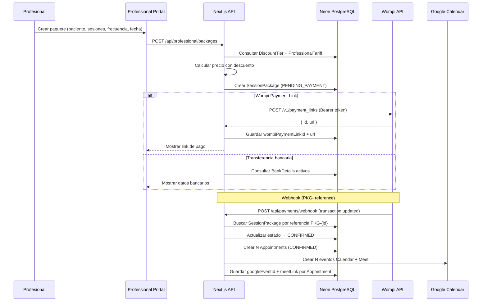
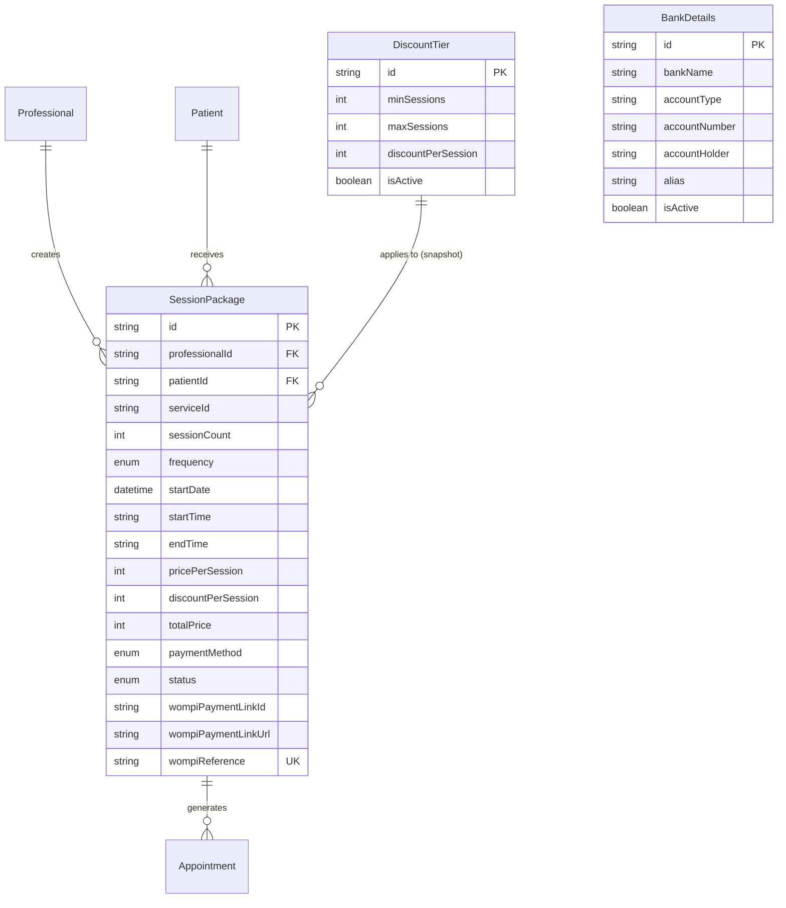

# Design Document — Session Packages

## Overview

El feature de Session Packages permite a los profesionales del portal crear paquetes de sesiones de acompañamiento psicológico para pacientes existentes. El sistema calcula descuentos escalonados (configurados por el admin), genera links de pago vía Wompi Payment Links API o muestra datos bancarios para transferencia, y al confirmar el pago, crea automáticamente todas las citas (Appointment) con eventos de Google Calendar + Meet link.

### Flujo principal



## Architecture

### Módulos del sistema

```mermaid
graph TB
    subgraph "Professional Portal (Frontend)"
        PC[Package Creator Wizard]
        PL[Package List View]
    end

    subgraph "Admin Panel (Frontend)"
        DTC[Discount Tier Config]
        BDC[Bank Details Config]
        APL[Admin Package List]
    end

    subgraph "API Layer"
        PKG_API[/api/professional/packages]
        DT_API[/api/admin/discount-tiers]
        BD_API[/api/admin/bank-details]
        WH[/api/payments/webhook - extended]
    end

    subgraph "Domain Logic"
        DE[Discount Engine]
        SS[Session Scheduler]
        PLG[Payment Link Generator]
        PCF[Package Confirmer]
    end

    subgraph "External Services"
        WOMPI[Wompi Payment Links API]
        GCAL[Google Calendar API]
    end

    PC --> PKG_API
    PL --> PKG_API
    DTC --> DT_API
    BDC --> BD_API
    APL --> PKG_API

    PKG_API --> DE
    PKG_API --> SS
    PKG_API --> PLG
    WH --> PCF

    PLG --> WOMPI
    PCF --> GCAL
    PCF --> SS
```

### Decisiones de arquitectura

| Decisión                                               | Justificación                                                                                                  |
| ------------------------------------------------------ | -------------------------------------------------------------------------------------------------------------- |
| Extender webhook existente en lugar de crear uno nuevo | Wompi envía todos los eventos al mismo endpoint; detectar prefijo `PKG-` permite reutilizar la infraestructura |
| Session Scheduler como función pura                    | Cálculo de fechas sin side effects, facilita testing y reutilización                                           |
| Discount Engine como función pura                      | Cálculo de precio separado de persistencia, testeable con property-based testing                               |
| Payment Link via API server-side                       | Requiere Bearer token con private key, no puede exponerse al frontend                                          |
| Almacenar `wompiPaymentLinkUrl` en SessionPackage      | Permite re-mostrar el link sin re-crear si el profesional navega fuera                                         |
| BankDetails como modelo global (no por profesional)    | Admin centraliza datos bancarios de la organización                                                            |

## Components and Interfaces

### API Routes

#### Professional Portal APIs

| Route                                    | Method | Purpose                                                     |
| ---------------------------------------- | ------ | ----------------------------------------------------------- |
| `/api/professional/packages`             | GET    | Listar paquetes del profesional (con filtros)               |
| `/api/professional/packages`             | POST   | Crear paquete + generar link de pago o mostrar bank details |
| `/api/professional/packages/[id]`        | GET    | Detalle de un paquete                                       |
| `/api/professional/packages/[id]/cancel` | POST   | Cancelar paquete en PENDING_PAYMENT                         |
| `/api/professional/packages/calculate`   | POST   | Calcular precio con descuento (preview)                     |

#### Admin Panel APIs

| Route                              | Method      | Purpose                                |
| ---------------------------------- | ----------- | -------------------------------------- |
| `/api/admin/discount-tiers`        | GET, POST   | Listar / Crear tramos de descuento     |
| `/api/admin/discount-tiers/[id]`   | PUT, DELETE | Editar / Eliminar tramo                |
| `/api/admin/bank-details`          | GET, POST   | Listar / Crear datos bancarios         |
| `/api/admin/bank-details/[id]`     | PUT, DELETE | Editar / Eliminar datos bancarios      |
| `/api/admin/packages`              | GET         | Listar todos los paquetes (admin view) |
| `/api/admin/packages/[id]/confirm` | POST        | Confirmar pago de transferencia        |
| `/api/admin/packages/[id]/reject`  | POST        | Rechazar pago pendiente                |
| `/api/admin/packages/[id]/status`  | PUT         | Cambiar estado (corrección admin)      |

### Frontend Components

#### Professional Portal — Package Creator Wizard

```
src/app/(professional)/profesional/paquetes/
├── page.tsx                          # Lista de paquetes
├── nuevo/
│   └── page.tsx                      # Wizard de creación
└── [id]/
    └── page.tsx                      # Detalle del paquete

src/components/professional/packages/
├── package-wizard.tsx                # Wizard container (multi-step)
├── step-patient-select.tsx           # Paso 1: Seleccionar paciente
├── step-sessions-config.tsx          # Paso 2: Cantidad de sesiones + preview precio
├── step-schedule.tsx                 # Paso 3: Fecha, hora, frecuencia + preview fechas
├── step-payment-method.tsx           # Paso 4: Wompi o Transferencia
├── step-summary.tsx                  # Paso 5: Resumen final + confirmar
├── package-list.tsx                  # Tabla de paquetes con búsqueda
├── package-detail.tsx                # Vista de detalle
└── payment-link-display.tsx          # Muestra link de Wompi para copiar/compartir
```

#### Admin Panel — Config & Management

```
src/app/(admin)/admin/paquetes/
├── page.tsx                          # Lista de todos los paquetes
└── pendientes/
    └── page.tsx                      # Paquetes pendientes de confirmación bancaria

src/app/(admin)/admin/configuracion/
├── descuentos/
│   └── page.tsx                      # CRUD de DiscountTier
└── datos-bancarios/
    └── page.tsx                      # CRUD de BankDetails

src/components/admin/packages/
├── admin-package-list.tsx            # Tabla con filtros
├── package-status-actions.tsx        # Botones confirmar/rechazar/cambiar estado
├── discount-tier-form.tsx            # Form crear/editar tramo
├── discount-tier-list.tsx            # Tabla de tramos
├── bank-details-form.tsx             # Form crear/editar datos bancarios
└── bank-details-list.tsx             # Tabla de datos bancarios
```

### Domain Logic (Pure Functions)

```typescript
// src/lib/packages/discount-engine.ts
export interface DiscountTier {
  minSessions: number;
  maxSessions: number;
  discountPerSession: number; // COP
}

export function calculatePackagePrice(
  pricePerSession: number,
  sessionCount: number,
  tiers: DiscountTier[],
): { totalPrice: number; discountPerSession: number; totalDiscount: number };

// src/lib/packages/session-scheduler.ts
export type Frequency = 'weekly' | 'biweekly' | 'monthly';

export interface ScheduledSession {
  date: Date;
  startTime: string;
  endTime: string;
}

export function calculateSessionDates(
  startDate: Date,
  startTime: string,
  endTime: string,
  sessionCount: number,
  frequency: Frequency,
): ScheduledSession[];

// src/lib/packages/payment-link-generator.ts
export async function createWompiPaymentLink(params: {
  packageId: string;
  amountInCents: number;
  customerName: string;
  customerEmail: string;
  description: string;
}): Promise<{ linkId: string; linkUrl: string }>;

// src/lib/packages/package-confirmer.ts
export async function confirmPackage(packageId: string): Promise<void>;
```

### Validation Schemas (Zod)

```typescript
// src/lib/validations/packages.ts
import { z } from 'zod';

export const createPackageSchema = z.object({
  patientId: z.string().cuid(),
  serviceId: z.string().cuid(),
  sessionCount: z.number().int().min(1),
  frequency: z.enum(['weekly', 'biweekly', 'monthly']),
  startDate: z.string().date(),
  startTime: z.string().regex(/^\d{2}:\d{2}$/),
  paymentMethod: z.enum(['wompi', 'bank_transfer']),
});

export const discountTierSchema = z.object({
  minSessions: z.number().int().min(2),
  maxSessions: z.number().int().min(2),
  discountPerSession: z.number().int().min(0),
});

export const bankDetailsSchema = z.object({
  bankName: z.string().min(1).max(100),
  accountType: z.string().min(1).max(50),
  accountNumber: z.string().min(1).max(50),
  accountHolder: z.string().min(1).max(200),
  alias: z.string().max(50).optional(),
  isActive: z.boolean().default(true),
});
```

## Data Models

### Nuevos modelos Prisma

```prisma
// ============================================
// ENUMS (nuevos)
// ============================================

enum PackageStatus {
  PENDING_PAYMENT
  CONFIRMED
  CANCELLED
}

enum PackagePaymentMethod {
  WOMPI
  BANK_TRANSFER
}

enum Frequency {
  WEEKLY      // 7 días
  BIWEEKLY    // 15 días
  MONTHLY     // 30 días
}

// ============================================
// PAQUETES DE SESIONES
// ============================================

model SessionPackage {
  id               String               @id @default(cuid())
  professionalId   String
  patientId        String
  serviceId        String
  sessionCount     Int
  frequency        Frequency
  startDate        DateTime
  startTime        String               // HH:mm
  endTime          String               // HH:mm

  // Pricing (snapshot al momento de creación)
  pricePerSession      Int              // COP (tarifa original)
  discountPerSession   Int    @default(0) // COP (descuento aplicado)
  totalPrice           Int              // COP (precio final total)

  // Payment
  paymentMethod        PackagePaymentMethod
  status               PackageStatus    @default(PENDING_PAYMENT)
  wompiPaymentLinkId   String?
  wompiPaymentLinkUrl  String?
  wompiReference       String?          @unique // PKG-{id}

  createdAt        DateTime             @default(now())
  updatedAt        DateTime             @updatedAt

  professional  Professional  @relation(fields: [professionalId], references: [id])
  patient       Patient       @relation(fields: [patientId], references: [id])
  appointments  Appointment[]

  @@map("session_packages")
}

// ============================================
// DESCUENTOS ESCALONADOS
// ============================================

model DiscountTier {
  id                 String   @id @default(cuid())
  minSessions        Int      // Mínimo de sesiones del rango (inclusive)
  maxSessions        Int      // Máximo de sesiones del rango (inclusive)
  discountPerSession Int      // Descuento en COP por sesión
  isActive           Boolean  @default(true)
  createdAt          DateTime @default(now())
  updatedAt          DateTime @updatedAt

  @@map("discount_tiers")
}

// ============================================
// DATOS BANCARIOS (configuración admin)
// ============================================

model BankDetails {
  id             String   @id @default(cuid())
  bankName       String   // Bancolombia, Davivienda, etc.
  accountType    String   // Ahorros, Corriente
  accountNumber  String
  accountHolder  String   // Titular
  alias          String?  // Nequi, Daviplata, etc.
  isActive       Boolean  @default(true)
  createdAt      DateTime @default(now())
  updatedAt      DateTime @updatedAt

  @@map("bank_details")
}
```

### Modificaciones a modelos existentes

```prisma
// Agregar a Professional:
model Professional {
  // ... campos existentes ...
  sessionPackages  SessionPackage[]
}

// Agregar a Patient:
model Patient {
  // ... campos existentes ...
  sessionPackages  SessionPackage[]
}

// Agregar a Appointment:
model Appointment {
  // ... campos existentes ...
  sessionPackageId  String?
  sessionPackage    SessionPackage? @relation(fields: [sessionPackageId], references: [id])
}
```

### Diagrama ER



## Correctness Properties

_A property is a characteristic or behavior that should hold true across all valid executions of a system — essentially, a formal statement about what the system should do. Properties serve as the bridge between human-readable specifications and machine-verifiable correctness guarantees._

### Property 1: Price calculation invariant

_For any_ valid session count (≥ 1), price per session (> 0), and set of discount tiers, the Discount Engine SHALL compute totalPrice as:

- If sessionCount = 1: `pricePerSession × 1` (no discount applied)
- If sessionCount ≥ 2 and a matching tier exists: `(pricePerSession - tier.discountPerSession) × sessionCount`
- If sessionCount ≥ 2 and NO matching tier exists: `pricePerSession × sessionCount`

The result must always be > 0 and the discountPerSession must never exceed pricePerSession.

**Validates: Requirements 1.2, 2.2, 2.3, 2.4, 2.5**

### Property 2: Patient eligibility filter

_For any_ set of patients with various appointment histories, the patient eligibility filter SHALL return only patients who have at least one Appointment with status CONFIRMED or COMPLETED with the specified professional. No patient without such an appointment shall appear in the result.

**Validates: Requirements 1.3**

### Property 3: Session scheduling interval invariant

_For any_ valid start date, session count (≥ 1), and frequency (weekly/biweekly/monthly), the Session Scheduler SHALL produce exactly `sessionCount` dates where each consecutive pair of dates differs by exactly:

- 7 days for weekly frequency
- 15 days for biweekly frequency
- 30 days for monthly frequency

The first date must equal the start date, and all dates must maintain the same startTime and endTime.

**Validates: Requirements 3.2, 3.3, 3.4, 3.5**

### Property 4: Package confirmation appointment creation

_For any_ SessionPackage with sessionCount N and scheduled dates D₁...Dₙ, when the package is confirmed, exactly N Appointments SHALL be created, each with:

- status = CONFIRMED
- patientId = package.patientId
- professionalId = package.professionalId
- serviceId = package.serviceId
- date/startTime/endTime matching the corresponding scheduled date

**Validates: Requirements 7.1, 7.2**

### Property 5: Payment link reference format and amount conversion

_For any_ SessionPackage with id `X` and totalPrice `P` (in COP), the Payment Link Generator SHALL produce:

- A reference string equal to `PKG-{X}`
- An amount in centavos equal to `P × 100`

**Validates: Requirements 8.2, 8.3**

### Property 6: Webhook PKG- routing

_For any_ webhook reference string, if and only if the reference starts with the prefix `PKG-`, the webhook handler SHALL route the event to package processing logic. References without this prefix SHALL be processed as individual appointment payments.

**Validates: Requirements 8.4**

### Property 7: Non-APPROVED webhook preserves pending state

_For any_ Wompi webhook event where the transaction status is NOT `APPROVED` (i.e., DECLINED, VOIDED, ERROR), the SessionPackage SHALL remain in `PENDING_PAYMENT` status. Only an `APPROVED` status triggers the transition to `CONFIRMED`.

**Validates: Requirements 8.6**

## Error Handling

### Estrategia de errores por módulo

| Módulo                 | Error                                | Comportamiento                                                                     |
| ---------------------- | ------------------------------------ | ---------------------------------------------------------------------------------- |
| Payment Link Generator | Wompi API timeout/5xx                | Mostrar error al profesional + opción reintentar. No crear paquete con link vacío. |
| Payment Link Generator | Wompi API 4xx (bad request)          | Log del error, mostrar mensaje genérico + opción reintentar.                       |
| Package Confirmer      | Google Calendar API falla            | Crear Appointment sin googleEventId/meetLink. Log error. No bloquear confirmación. |
| Package Confirmer      | Falla parcial (3 de 5 citas creadas) | Usar transacción Prisma: si falla una, rollback todas. Mantener PENDING_PAYMENT.   |
| Webhook                | Referencia PKG- no encontrada en DB  | Log warning, responder 404. No procesar.                                           |
| Webhook                | Firma inválida                       | Rechazar con 401. Log intento sospechoso.                                          |
| Discount Engine        | discountPerSession ≥ pricePerSession | Aplicar discount = 0 (fallback seguro). Log warning.                               |
| Session Scheduler      | Fecha de inicio en el pasado         | Validación en API: rechazar con 400 antes de crear paquete.                        |

### Transaccionalidad

```typescript
// Package Confirmer usa transacción Prisma para atomicidad
await prisma.$transaction(async (tx) => {
  // 1. Actualizar estado del paquete → CONFIRMED
  await tx.sessionPackage.update({ ... });

  // 2. Crear TODAS las appointments
  await tx.appointment.createMany({ data: appointments });

  // Si falla cualquiera → rollback automático
});

// 3. Google Calendar (fuera de transacción — fire-and-forget)
// Si falla Calendar, las citas ya están confirmadas
for (const appointment of createdAppointments) {
  try {
    const event = await createCalendarEvent({ ... });
    await prisma.appointment.update({
      where: { id: appointment.id },
      data: { googleEventId: event.eventId, meetLink: event.meetLink }
    });
  } catch (err) {
    console.error(`[PackageConfirmer] Calendar event failed for ${appointment.id}:`, err);
  }
}
```

### Rate Limiting y Throttling

- Google Calendar API: máximo 1 request por segundo por profesional (usar `Promise` secuencial con delay de 1s)
- Wompi Payment Links: sin rate limit documentado, pero implementar retry con exponential backoff (max 3 intentos)

## Testing Strategy

### Property-Based Tests (fast-check)

Librería: **fast-check** (TypeScript/JavaScript PBT library)
Configuración: mínimo 100 iteraciones por property.

| Property                | Módulo bajo test               | Generadores                                                                 |
| ----------------------- | ------------------------------ | --------------------------------------------------------------------------- |
| 1: Price calculation    | `discount-engine.ts`           | Arbitrary sessionCount (1-100), pricePerSession (10000-500000), tiers array |
| 2: Patient eligibility  | `patient-filter` (query logic) | Arbitrary patients with random appointment statuses                         |
| 3: Session scheduling   | `session-scheduler.ts`         | Arbitrary startDate, sessionCount (1-52), frequency enum                    |
| 4: Appointment creation | `package-confirmer.ts`         | Arbitrary package data with scheduled dates                                 |
| 5: Reference format     | `payment-link-generator.ts`    | Arbitrary packageId (cuid), totalPrice                                      |
| 6: Webhook routing      | `webhook-router`               | Arbitrary reference strings (some with PKG- prefix, some without)           |
| 7: State preservation   | `webhook-handler`              | Arbitrary non-APPROVED statuses                                             |

Cada test se etiquetará con:

```typescript
// Feature: session-packages, Property 1: Price calculation invariant
```

### Unit Tests (Vitest)

- Discount Engine: ejemplos concretos con tiers conocidos
- Session Scheduler: fechas específicas para verificar correctness visual
- Zod validations: inputs inválidos rechazados correctamente
- Package Creator API: mocking Prisma + verificar respuestas

### Integration Tests

- Webhook extension: simular payloads con PKG- references
- Wompi Payment Links API: mock del endpoint con respuestas exitosas y fallidas
- Package Confirmer + Google Calendar: mock Calendar API, verificar appointments + events creados
- Admin confirmation flow: end-to-end de confirmar pago bancario → crear citas

### E2E Considerations

- Professional wizard flow: crear paquete completo (Playwright)
- Admin confirmation: confirmar transferencia → verificar citas creadas
- Webhook integration: enviar evento Wompi simulado → verificar estado + citas
